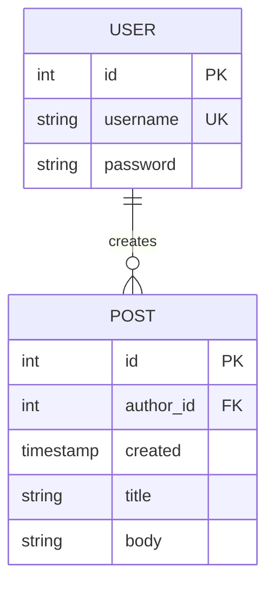

# flask-temp
Here is the tutorial about Flask web application. [refernece](https://flask.palletsprojects.com/en/3.0.x/)

## Database Schema

### User Table


## Setup Environment
Windows/MacOS:
``` bash
python3 -m venv virtualenv
```

## Activate environment 
MacOS:
```
source ./virtualenv/bin/activate
```
Windows:
```
.\virtualenv\Scripts\activate
```

## Initialize Database
```
flask --app flaskr init-db
```

## Run Webapp (Debug mode on)
```
flask -app flaskr run --debug
```

## Deactivate Environment
```
Deactivate
```
